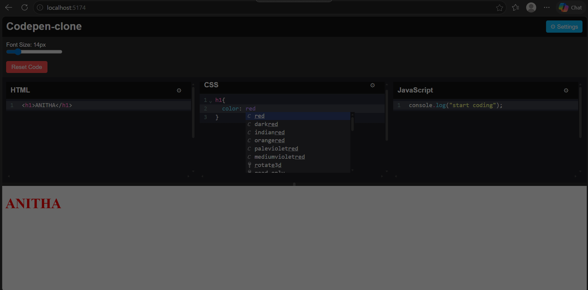

# Codepen- Online Frontend Editor

## 📌 Project Description
Codepen is an online frontend editor that allows users to write and test HTML, CSS, and JavaScript code in real time. It provides a simple and interactive coding environment where users can instantly view the output of their code.

## 🚀 Features
- Write and edit HTML, CSS, and JavaScript code
- Live code preview/output
- Syntax highlighting with CodeMirror
- Dark theme editor interface
- Adjustable font size
- Resizable editor and output panels
- Internal scrolling for a better coding experience
- Responsive and user-friendly UI

## 🛠 Technologies Used
- React.js
- HTML
- CSS
- JavaScript
- CodeMirror

## ▶ How to Run the Project

### 1. Clone the repository

```bash
git clone <repository-link>
```
2. Open the project folder

```Bash
cd codepen-clone
```
3. Install dependencies

```Bash
npm install
```
4. Start the development server

```Bash
npm run dev
```

5. Open in browser

```Bash
http://localhost:5173
```
##ScreenShot

